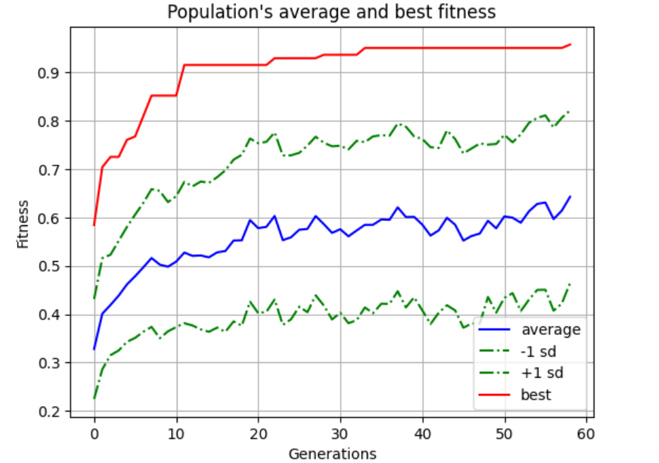
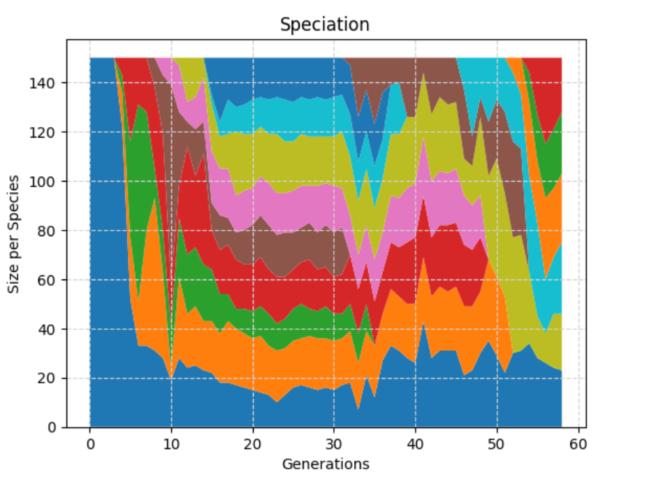
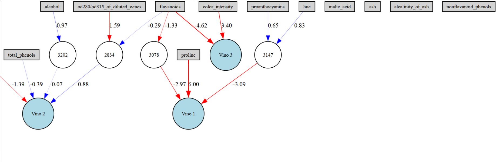

# Clasificación de Vinos mediante Neuroevolución con NEAT-Python

## Descripción

Este proyecto implementa una Red Neuronal Artificial evolucionada mediante el algoritmo **NEAT (NeuroEvolution of Augmenting Topologies)** utilizando la biblioteca **NEAT-Python**.

A diferencia de los métodos tradicionales de entrenamiento basados en descenso de gradiente y backpropagation, NEAT optimiza simultáneamente:

- La estructura de la red neuronal.
- Los pesos de las conexiones.
- Las conexiones entre neuronas.

El objetivo es construir automáticamente una red capaz de clasificar distintas variedades de vino a partir de sus características químicas.

---

## Objetivos

- Implementar redes neuronales mediante neuroevolución.
- Comprender el funcionamiento del algoritmo NEAT.
- Evolucionar automáticamente arquitecturas neuronales.
- Aplicar técnicas de aprendizaje supervisado para clasificación multiclase.
- Analizar el comportamiento evolutivo de una población de redes neuronales.

---

## Dataset

Se utilizó el **Wine Dataset**, disponible en Scikit-Learn.

Este conjunto de datos contiene información química obtenida a partir de análisis de laboratorio de tres variedades distintas de vino.

### Características

- 178 muestras.
- 13 variables numéricas.
- 3 clases.

Algunas variables incluyen:

- Alcohol
- Ácido málico
- Cenizas
- Alcalinidad de las cenizas
- Magnesio
- Fenoles totales
- Flavonoides
- Intensidad de color
- Prolina

---

## Metodología

### Preprocesamiento

Antes del entrenamiento se realizaron las siguientes etapas:

- Carga del Wine Dataset.
- Normalización mediante `MinMaxScaler`.
- División en conjuntos de entrenamiento y prueba.
- Inicialización de una población de genomas.

### Neuroevolución

Se utilizó la biblioteca **NEAT-Python** para evolucionar redes neuronales.

Cada individuo de la población representa una red neuronal completa.

Durante el proceso evolutivo los individuos pueden:

- Modificar pesos.
- Agregar nuevas conexiones.
- Incorporar nuevas neuronas.
- Formar especies para preservar innovación genética.

La función de aptitud (*fitness*) se calcula a partir de la precisión obtenida durante el entrenamiento.

---

## Configuración del Algoritmo

Los parámetros evolutivos se encuentran definidos en el archivo:

```text
config-wine
```

Entre ellos:

- Tamaño de población.
- Probabilidades de mutación.
- Probabilidades de cruza.
- Especiación.
- Criterios de selección.
- Número máximo de generaciones.

---

## Resultados

La mejor red neuronal encontrada alcanzó:

| Métrica | Valor |
|----------|----------|
| Accuracy | 100.00% |

La solución evolucionada fue capaz de clasificar correctamente todas las muestras evaluadas en el experimento.

---

## Visualizaciones

### Evolución del Fitness

La siguiente figura muestra el comportamiento del fitness durante el proceso evolutivo.



---

### Evolución de Especies

La evolución de especies permite preservar diversidad genética durante la búsqueda.



---

### Topología de la Red Evolucionada

NEAT genera automáticamente la estructura de la red neuronal.

La siguiente imagen muestra la arquitectura obtenida por el mejor genoma encontrado.



---

## Estructura del Proyecto

```text
.
├── Wine_evol.ipynb
├── config-wine
├── visualize.py
├── fitness.png
├── speciation.png
├── red_imagen.png
└── README.md
```

---

## Tecnologías Utilizadas

- Python
- NEAT-Python
- Scikit-Learn
- NumPy
- Matplotlib
- Graphviz

---

## Conceptos Aplicados

Durante este proyecto se aplicaron conceptos relacionados con:

- Redes Neuronales Artificiales.
- Neuroevolución.
- Algoritmos Evolutivos.
- Optimización Evolutiva.
- Clasificación Multiclase.
- Aprendizaje Supervisado.
- NEAT (NeuroEvolution of Augmenting Topologies).
- Machine Learning.

---

## Conclusiones

Los resultados obtenidos muestran que NEAT puede utilizarse para generar automáticamente arquitecturas neuronales capaces de resolver problemas de clasificación sin necesidad de definir manualmente la estructura de la red.

La evolución simultánea de topología y pesos constituye una alternativa interesante a los métodos tradicionales de entrenamiento basados exclusivamente en descenso de gradiente.

---

## Trabajo Futuro

Algunas extensiones posibles de este proyecto incluyen:

- Comparación contra MLPClassifier.
- Comparación contra redes entrenadas mediante backpropagation.
- Aplicación a datasets de mayor dimensión.
- Optimización multiobjetivo.
- Uso de NEAT para problemas de visión por computadora.

---

## Referencias y Créditos

### NEAT-Python

La implementación utilizada en este proyecto corresponde a la biblioteca **NEAT-Python**, una implementación en Python del algoritmo NEAT propuesto por:

- Kenneth O. Stanley
- Risto Miikkulainen

Documentación oficial:

- https://neat-python.readthedocs.io/en/latest/

Repositorio oficial:

- https://github.com/CodeReclaimers/neat-python

### Visualización de Resultados

El archivo `visualize.py` incluido en este repositorio está basado en el ejemplo oficial publicado por los desarrolladores de NEAT-Python:

- https://github.com/CodeReclaimers/neat-python/blob/master/examples/xor/visualize.py

Se realizaron adaptaciones menores para integrarlo con el experimento desarrollado en este proyecto.

---

## Aprendizajes

Durante este proyecto se aplicaron conceptos relacionados con:

- Neuroevolución.
- Optimización Evolutiva.
- Redes Neuronales Artificiales.
- Aprendizaje Supervisado.
- Algoritmos Genéticos.
- Especiación.
- Búsqueda automática de arquitecturas neuronales.
- Machine Learning con Python.

---

## Autor

Jairo Isaac Muñoz López

Estudiante de Licenciatura en Matemáticas Aplicadas.

GitHub: https://github.com/munlopezi-lab
